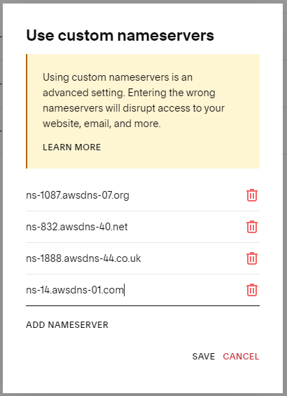

# AWS DNS Management

## `apply-all.sh`

Runs the deployments that follow. Pauses for manual steps.

## Deploy zones for domains

```bash
cd zones
terraform init $(backend_config)
terraform apply
cd ..
```

## Configure Squarespace-managed domains to use AWS Route 53 DNS

This is a required manual step which must occur before certificates can be issued to the domains. Subsequent steps require issued certificates.

[https://account.squarespace.com/domains](https://account.squarespace.com/domains)

For each domain:
1. Select the domain
1. DNS -> DNS Settings -> Squarespace Defaults -> 🗑️
1. DNS -> Domain Nameservers -> Use Custom Nameservers
1. enter terraform output for the respective domain



## Configure domain certificates & domain validation

```bash
cd validation
terraform init $(backend_config)
terraform apply
cd ..
```

## Configure redirects

Set `jawhite04.net` and `jawhite04.org` to 301 Permanent Redirect to `jawhite04.com`.

```bash
cd redirects
terraform init $(backend_config)
terraform apply
cd ..
```
